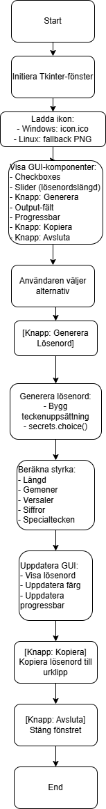

# **Password Generator** *Lösenord generator*

Ett grafiskt Python‑program som genererar säkra lösenord baserat på användarens val. Programmet fungerar både i Windows och Linux, och kan kompileras till en fristående körbar fil med PyInstaller.

## Hur det fungerar

Programmet genererar lösenord genom att kombinera olika teckentyper baserat på användarens val. 
Styrkan beräknas genom en poängmodell som tar hänsyn till längd, variation och teckentyper.

## Funktioner

Genererar lösenord med:
- Konsonanter
- Vokaler
- Siffror
- Specialtecken
- Välj lösenordslängd (8–20 tecken)
- Kopiera lösenordet till urklipp med en knapp
- Visuell indikator för lösenordets styrka (svagt, medel, starkt)
- Tooltips som förklarar varje val
- Fungerar på både Windows och Linux
- Automatisk hantering av ikonfiler beroende på operativsystem

## Tekniker och bibliotek

- Python 3
- Tkinter (GUI)
- Secrets (säker slumpgenerering)
- String
- PyInstaller (för att skapa .exe och Linux‑binärer)

## Installation (körning via Python)

### 1.  Klona projektet  
    git clone https://github.com/juanmartin1903/passwordgen
    cd passwordgen
### 2.  Kör programmet 
    python3 passwordgen.py

## Bygga körbar fil (PyInstaller)
### Windows 
pyinstaller  --onefile --windowed --icon=icon.ico --add-data "copy.png;." passwordgen.py

###   Linux / Ubuntu / WSL
pyinstaller --onefile --windowed --add-data=copy.png:. passwordgen.py


## Obs:
- Windows använder ; i --add-data
- Linux använder :
- .ico fungerar endast som ikon i Windows
- Linux använder fallback‑ikon automatiskt

## Plattformsstöd

| Plattform        | Stöd | Kommentar |
|------------------|------|-----------|
| **Windows**      |  ✔   | Full ikon‑support (.ico) |
| **Linux/Ubuntu** |  ✔   | Använder PNG‑ikon som fallback |
| **WSL**          |  ✔   | Rekommenderas att kompilera .exe i Windows |

## Projektstruktur

```
passwordgen/
│
├── src/
│   ├── passwordgen.py
│   ├── icon.ico
│   ├── copy.png
│   └── README.md
│
└── dist/ (skapas av PyInstaller)
```

## Kända problem
- .ico fungerar inte i Linux (Tkinter‑begränsning)
- PyInstaller måste köras i Windows för att skapa .exe
- Ikoner måste inkluderas manuellt via --add-data

## Licens
Endast för utbildningsbruk

## Diagram (draw.io)

Nedan visas flödet för hur programmet fungerar:



## Författare
Juan — IT‑Drifteknikerprogrammet, Jensen - Stockholm